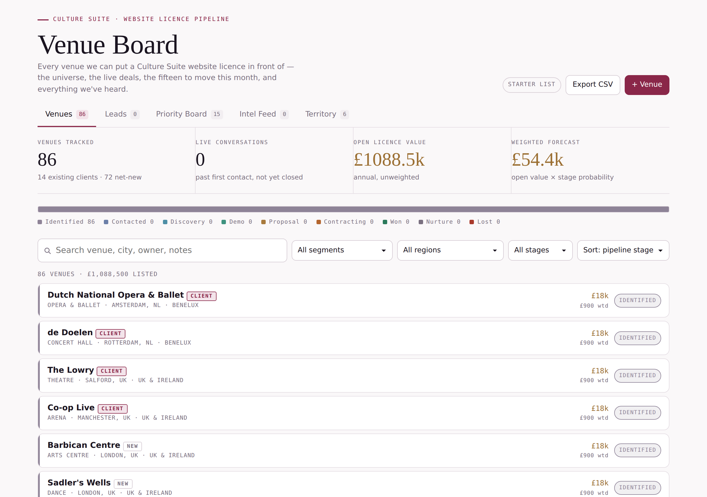
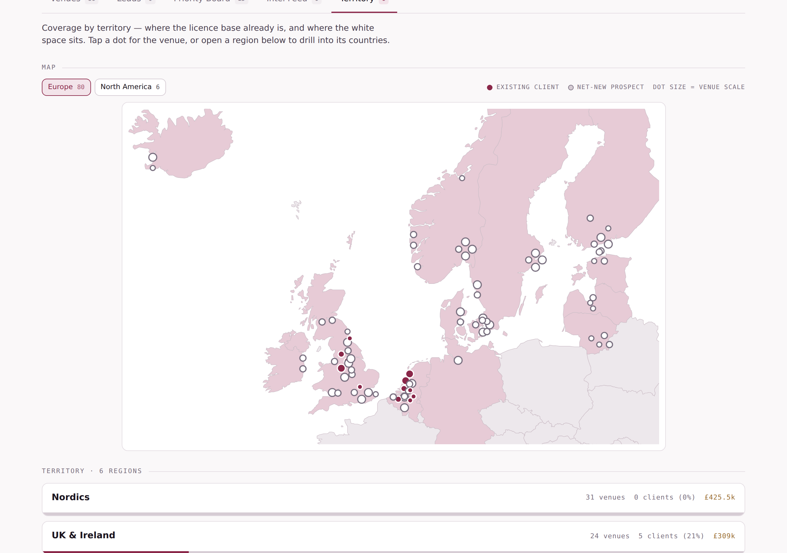

# Culture Suite Venue Board

A website-licence sales pipeline for ticketed cultural venues — theatres, opera houses, concert
halls, museums, arts centres and festivals. Five views over one dataset: **Venues**, **Leads**,
**Priority Board**, **Intel Feed** and **Territory**, the last with a map that needs no tile server.



Vanilla HTML, CSS and JavaScript. No framework, no bundler, no runtime dependencies. The only
external request the page makes is to Google Fonts, and it degrades to system fonts without it.

---

## Quick start

**Just want to look at it:** open `dist/venue-board.html` in a browser. It is fully
self-contained — data, map geometry and all — and works straight off the filesystem.

**Want to work on it:**

```bash
npm install          # only needed if you plan to regenerate the map
npm start            # serves src/ at http://localhost:5173
```

`src/` needs a server rather than `file://` because it fetches its data as JSON.
Any static host will do — GitHub Pages serves it as-is with no build step.

**Rebuild the single-file version after editing `src/`:**

```bash
npm run build        # -> dist/venue-board.html
```

---

## What's in the repo

```
src/
  index.html            markup for the shell — header, tabs, mount point
  styles.css            all styling, including both colour themes
  app.js                the whole application (~900 lines, no dependencies)
  data/
    seed-venues.json    86 starter venues (see "About the data" below)
    maps.json           pre-projected country outlines as SVG path data
tools/
  build-maps.mjs        regenerates data/maps.json from Natural Earth boundaries
  build-single.mjs      inlines src/ into dist/venue-board.html
dist/
  venue-board.html      self-contained build — this is the drop-in file
docs/                   screenshots for this README
```

---

## The five views

| View | What it shows |
| --- | --- |
| **Venues** | The whole universe. Filter by segment, territory or stage; sort by stage, value, due date or name. Every field is editable inline. |
| **Leads** | Only venues past first contact and not yet closed, with weighted forecast, overdue next steps and a gone-quiet count. |
| **Priority Board** | Top 15 by a scoring function (scale, warmth, slippage, pins), each with a generated first-contact draft that can be edited, copied or reset. |
| **Intel Feed** | A manual log of what you hear about a venue — a redevelopment, a new marketing lead, an RFP — threaded onto the venue record. |
| **Territory** | Coverage by region: a projected map with venues plotted by coordinate, plus a region → country → venue drill-down with client-penetration meters. |

---

## Data model

One venue record:

```json
{
  "id": "bristol-old-vic",
  "name": "Bristol Old Vic",
  "city": "Bristol",
  "country": "UK",
  "region": "UK & Ireland",
  "cls": "Theatre",
  "segment": "prospect",
  "tier": "mid",
  "value": 11000,
  "lat": 51.45,
  "lon": -2.59,
  "stage": "identified",
  "owner": "",
  "nextStep": "",
  "due": "",
  "lastTouch": "",
  "notes": "",
  "msg": "",
  "pin": false
}
```

- `segment` — `"client"` (existing customer, upsell) or `"prospect"` (net-new).
- `tier` — `"flagship"` | `"mid"` | `"small"`. Drives the default licence value and the map dot size.
- `stage` — one of `identified, contacted, discovery, demo, proposal, contracting, won, nurture, lost`.
  Each carries a probability used for the weighted forecast; the table lives in `STAGES` at the top of `app.js`.
- `region` is free text. Add a new one by typing it on any venue — the filters, the territory
  view and the tab counts all derive from the data.
- `lat` / `lon` place the venue on the map. Leave them null and the venue simply doesn't plot;
  the map tells you how many are unplaced.

Intel entries are separate: `{ id, date, venue, kind, text }` where `kind` is
`signal | touch | risk | note` and `venue` is a venue `id`.

---

## Persistence

The board is deliberately backend-free, and reads its state in this order:

1. `data/board.json` — a saved board, if one exists.
2. `localStorage` — whatever this browser last saved.
3. `data/seed-venues.json` — the shipped starter list.

Writes go to `localStorage`, debounced. **There is no shared server-side persistence** — two
people editing in two browsers will not see each other's changes.

To wire it to a real backend, there are exactly two functions to replace in `app.js`:

- `getJSON(url)` — how state is read.
- `save()` — how state is written. It already debounces (1.4s) and reports status through
  `setChip()`, so a `fetch(..., {method:"PUT"})` in place of the current body is enough.

The file also contains an optional branch that uses the Claude Artifacts runtime
(`window.claude.use("artifact")`) to publish new versions of itself. That is inert
anywhere else and can be deleted outright — search for `window.claude`.

---

## The map



Map tiles need a tile server and an external request per tile. This draws the geography instead:
`tools/build-maps.mjs` takes Natural Earth country boundaries (via the `world-atlas` package),
projects them to Mercator with `d3-geo`, rounds the coordinates to whole pixels and writes the
resulting SVG path data to `src/data/maps.json`. At runtime the page reimplements the same
Mercator formula in about six lines so it can project venue coordinates onto the identical grid.

Consequences worth knowing:

- No network requests, no API key, no attribution requirement beyond Natural Earth's public domain terms.
- The extents are fixed at build time. To change them, edit `DEFS` in `tools/build-maps.mjs` and run
  `npm run build:maps`. Currently: **europe** (Reykjavík to Vilnius) and **na** (Hawaii to Newfoundland).
- Countries are tinted when they hold at least one venue. The name → ISO lookup is the `ISO` object
  in the same file; a country missing from it renders but never tints.
- Venues in the same town are fanned out around their true position so each dot stays clickable,
  with a second pass guaranteeing no dot is completely hidden.

---

## Styling and theming

Every colour is a CSS custom property defined in three places in `styles.css`: bare `:root`
(light), `@media (prefers-color-scheme: dark)` guarded with `:root:not([data-theme="light"])`,
and `:root[data-theme="dark"]`. That covers a viewer whose theme is explicit *and* one whose
theme is only a system preference. **If you add a colour, add it to all three** — a colour defined
only inside a media query renders one theme's text on the other theme's background.

Typefaces are Instrument Serif (display), IBM Plex Sans (UI) and IBM Plex Mono (labels and
figures), loaded from Google Fonts with real fallback stacks. Swap the `<link>` in `index.html`
and the `--display` / `--sans` / `--mono` tokens together.

---

## About the data

**Venue names, cities, classes and coordinates are real and researched.** 86 organisations across
the UK & Ireland, Benelux, the Nordics, the Baltics, DACH and North America. The 14 marked as
existing clients are organisations Culture Suite publicly lists as customers.

**Every commercial field is a placeholder.** Licence values default to indicative bands by venue
scale — flagship £18,000, mid-scale £11,000, small £6,500 annually — purely so the forecast
arithmetic has something to work with. Every venue starts at stage `identified` with no owner and
no next step. Replace these with real figures before anyone quotes a number off this board.

The Intel Feed ships empty by design: a static page cannot fetch news, so entries are logged by hand.

---

## Licence

No licence file is included — decide what you want before publishing the repo. The venue data is
factual information about public organisations; the Natural Earth boundary data underlying
`maps.json` is public domain.
